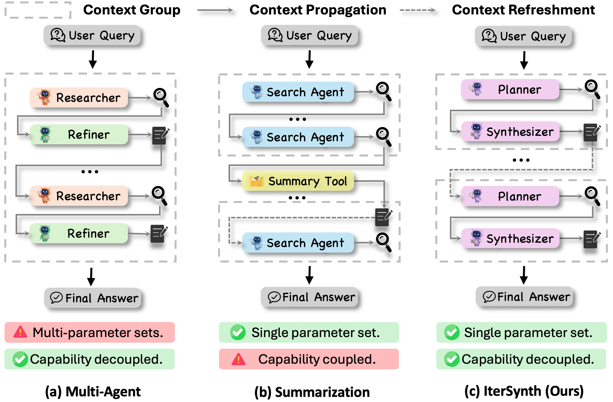
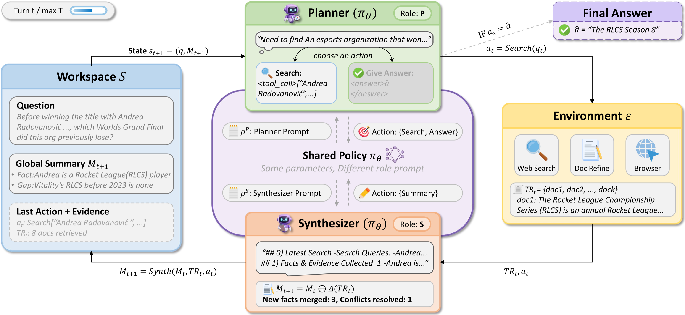
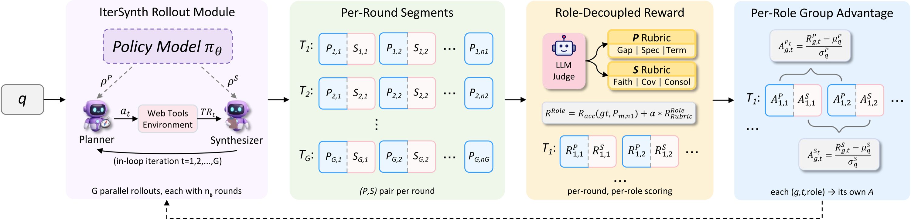

<div align="center">

<h1 style="display: flex; justify-content: center; align-items: center; gap: 10px; margin: 0;">
IterSynth: Rethinking Deep Search Agents via Role-Decoupled Iterative Synthesis
</h1>

<p><em>A role-decoupled, summary-based deep-search agent paradigm, trained with Role-Decoupled Policy Optimization (RDPO).</em></p>


[](./LICENSE.txt)

</div>

<br>

<div align="center">
  
  <p><em>Figure 1: Structural comparison of long-horizon reasoning paradigms. IterSynth uniquely combines a <b>single parameter set</b> with <b>capability-decoupled Planner–Synthesizer roles</b>, achieving the specialization benefit of multi-agent systems and the bounded-context benefit of summarization within one shared policy.</em></p>
</div>

---

## 🎉 News

* **[2026-09]** RL training code for IterSynth (dual-role rollout, reward managers, RDPO advantage computation) is open-sourced as a patch on top of [verl](https://github.com/volcengine/verl).

---

## Table of Contents

* [Overview](#-overview)
* [Motivation](#-motivation)
* [Highlights](#-highlights)
* [Method](#️-method)
* [Results](#-results)
* [Repository Structure](#-repository-structure)
* [Installation](#-installation)
* [Usage](#-usage)
* [Advanced Training Techniques](#️-advanced-training-techniques)
* [Troubleshooting](#-troubleshooting)
* [Security & Compliance](#-security--compliance)
* [Citation](#-citation)
* [Acknowledgement](#-acknowledgement)
* [License](#-license)

---

## 📖 Overview

**IterSynth** is a role-decoupled and summary-based paradigm for long-horizon deep search. Instead of letting one monolithic ReAct-style context perform search, reasoning, evidence aggregation and answer generation all at once, IterSynth decomposes the process into an iterative loop between two specialized roles executed by **one shared LLM policy**:

* the **Planner** decides *where to search next* based on the current research state, and
* the **Synthesizer** integrates newly retrieved evidence into a **persistent global summary**.

To train this workflow end-to-end, we introduce **Role-Decoupled Policy Optimization (RDPO)**, which combines terminal outcome rewards with turn-level rubric evaluations and normalizes advantages **independently per role**, so that the dense Synthesizer-side signals and the sparse Planner-side signals never contaminate each other's credit assignment.

This repository provides the **RL training infrastructure** for IterSynth, released as a patch over [verl](https://github.com/volcengine/verl): the dual-role rollout, the RDPO reward manager and rubric scoring, the advantage computation, plus a ready-to-use search/browse tool layer.

---

## 🔍 Motivation

Deep search requires LLM agents to decompose complex queries, search for evidence, and synthesize grounded answers. Existing ReAct-style agents suffer from two structural limitations:

1. **Role coupling** — a single policy must simultaneously handle planning, evidence use, and answer synthesis. One monolithic context has to satisfy competing objectives, and a mistake in early planning is silently embedded into everything that follows.
2. **Context accumulation** — as the search history grows across turns, the raw tool-call trace introduces noise and gradually obscures the information that actually matters, suffocating the reasoning space.

Prior work attacks this from two directions, and each pays a price:

| Paradigm | Parameter sets | Capability decoupled? | Context bounded? |
|---|---|---|---|
| **Multi-Agent** (e.g. Researcher + Refiner roles) | Multiple | ✅ Yes | ✅ Yes |
| **Summarization** (e.g. iterative summary tools) | Single | ❌ No | ✅ Yes |
| **IterSynth (ours)** | **Single** | **✅ Yes** | **✅ Yes** |

IterSynth asks a different question: *what if a single shared policy could alternate between two role-conditioned behaviors, using an explicit, evolving summary as its only persistent state?* The answer gives the specialization benefit of multi-agent systems **without extra models**, and the context-control benefit of summarization **while making summary updates an explicit, optimizable part of the agent's behavior** rather than a passive compression step.

---

## ✨ Highlights

* 🧩 **Role-decoupled Planner–Synthesizer paradigm** — a single shared LLM alternates between two role-conditioned sub-steps; role specialization comes purely from prompts, information access, and action-space constraints.
* 🧠 **Summary as the persistent search state** — the active context is reconstructed from `(query, summary)` at every iteration instead of the ever-growing raw history, bounding context length.
* ⚙️ **RDPO** — per-turn composite rewards (a globally broadcast outcome signal + role-specific rubric scores) are partitioned into **two role-specific pools** and normalized independently before the standard GRPO update.
* 📈 **State-of-the-art among ≤8B trained search agents** — IterSynth-8B reaches **50.7** average across five long-horizon benchmarks, **+4.2** over the strongest prior ≤8B agent, and remains competitive with several 30B-scale agents at less than one third of the parameter budget.
* 🔁 **Also a training-free prompting workflow** — the same protocol improves Claude-4.5-Opus and DeepSeek-V3.1 with no parameter updates at all.
* 🛡️ **Robust abnormal-trajectory handling** — environment failures (search API errors, overlong truncation) are separated from model behavior issues (output degeneration, excessive tool calls) and handled differently in the loss.

---

## 🏗️ Method

<div align="center">
  
  <p><em>Figure 2: The IterSynth pipeline. At each iteration a shared policy alternates between a <b>Planner</b> sub-step that issues a search query or a final answer conditioned on the global summary, and a <b>Synthesizer</b> sub-step that integrates the retrieved evidence into an updated summary. The active context is reconstructed from (q, M<sub>t+1</sub>) at the beginning of every iteration.</em></p>
</div>

**The workflow.** The agent's persistent memory is a global summary `M_t`, so the state is simply `(q, M_t)` — the original question plus the evidence consolidated so far. The Planner only ever sees this compact state, never the full history of previous queries, retrieved documents, and reasoning traces. The same shared policy then plays two roles in sequence:

* the **Planner** reads `(q, M_t)` and either issues a `SEARCH(q_t)` action or emits the final answer, which terminates the trajectory;
* if a search was issued, the **Synthesizer** takes the retrieved evidence and rewrites the summary into `M_{t+1}` — it can only update memory, and cannot query or answer.

Role specialization therefore comes entirely from role prompts, information access, and action-space constraints — **no extra parameters, no separate models**.

<div align="center">
  
  <p><em>Figure 3: Overview of Role-Decoupled Policy Optimization. Per-turn composite rewards are first computed from a globally broadcast outcome signal and role-specific rubric scores, and are then partitioned into two role-specific groups, within which advantages are normalized independently before being fed into the standard policy update.</em></p>
</div>

**Training recipe.** IterSynth is trained in two stages. A **cold-start SFT** stage — roughly 10K filtered Planner–Synthesizer trajectories that survive verification — teaches the interaction protocol. **RDPO** then optimizes behavior with RL: every turn receives a composite reward that combines the terminal outcome (broadcast across the whole trajectory) with that role's rubric score, and advantages are normalized **separately within the Planner pool and the Synthesizer pool** before the standard GRPO update. Keeping the two pools separate is the essential part: with the identical composite reward but mixed-role normalization, our ablation falls *below* outcome-only GRPO, because dense Synthesizer-side and sparse Planner-side signals should not share one baseline.

> The SFT stage is **not** included in this release — bring your own SFT checkpoint as `MODEL_PATH`.

---

## 📊 Results

### Main Results

**Table 1: Performance on five long-horizon deep-search benchmarks** — IterSynth-8B vs. prior trained agents at the same (≤8B) scale.

| Model | BrowseComp | BrowseComp-ZH | GAIA (text-only) | Xbench-DS-2505 | Xbench-DS-2510 | **Average** |
|---|---|---|---|---|---|---|
| OffSeeker-8B-DPO | 12.8 | 26.6 | 51.5 | 49.0 | – | 35.0 |
| WebExplorer-8B-RL | 15.7 | 32.0 | 50.0 | 53.7 | 23.0 | 34.9 |
| AgentCPM-Explore-4B | 24.1 | 29.1 | 63.9 | 70.0 | 34.0 | 44.2 |
| MiroThinker-v1.0-8B | 31.1 | 40.2 | 66.4 | 60.6 | 34.0 | 46.5 |
| **IterSynth-8B (Ours)** | 30.9 | **55.4** | 55.3 | 66.0 | **46.0** | **50.7** |

**Key observations:**

* **Best among ≤8B trained agents** — average **50.7**, **+4.2** over the strongest prior small agent (MiroThinker-v1.0-8B).
* **Largest gains where exploration matters most** — **55.4** on BrowseComp-ZH (**+15.2** over the strongest small-agent baseline) and **+5.4** on Xbench-DS-2510.
* **Punches far above its weight class** — with only 8B parameters it surpasses several 30B-scale agents (e.g. ReSum-30B, AgentFold-30B-A3B, OpenSeeker-30B-SFT) and approaches IterResearch-30B-A3B / WebSailor-V2-30B at **less than one third** of the parameter budget.
* **Also a strong training-free workflow** — used purely as a prompting scaffold (no parameter updates), IterSynth averages **66.1** on Claude-4.5-Opus and **47.9** on DeepSeek-V3.1, beating both ReAct and IterResearch on the same backbones.

> Full comparisons against foundation models with tools and ≥30B trained agents, plus the training-methodology and role-swap ablations, are available in the paper (Tables 1–4).

---

## 📦 Repository Structure

> **Important**: this repository does **not** ship a full copy of verl. It only contains files that are new or modified relative to an official verl checkout (around `v0.5.0.dev`), located under `patch/`. You need your own official verl repo and the scripts here to overlay the patch — see [Installation](#-installation).

```
ps-pipeline-release/
├── LICENSE.txt                   # Tencent open-source license (Apache-2.0 + dependency attributions)
├── run_train.sh                  # Training launcher (auto-starts local Ray; supports dapo/grpo/gspo/drgrpo)
├── scripts/
│   ├── apply_patch.sh            # Overlay patch/ onto an official verl repo
│   ├── switch_rollout_mode.sh    # Switch between single-agent ReAct and PS-Pipeline (IterSynth) mode
│   └── init_node_env.sh          # Per-node initialization script for multi-node training
├── patch/                        # * Core: customized code overlaid onto the official verl repo
│   ├── verl/
│   │   ├── workers/
│   │   │   ├── reward_manager/   # 9 custom Reward Managers, incl. the RDPO implementation
│   │   │   ├── rollout/
│   │   │   │   └── sglang_rollout/
│   │   │   │       ├── sglang_rollout.py     # Single-agent ReAct rollout (active by default)
│   │   │   │       └── sglang_rollout_lf.py  # Planner-Synthesizer (IterSynth) dual-role rollout
│   │   │   ├── actor/dp_actor.py
│   │   │   └── fsdp_workers.py
│   │   ├── trainer/
│   │   │   ├── ppo/{ray_trainer.py, core_algos.py}
│   │   │   └── config/{reward.yaml, reward_dapo.yaml, reward_dapo_trajectory_v2_cgrpo.yaml}
│   │   ├── tools/                # Search / web-visit tools + tool config (Serper.dev + Jina Reader)
│   │   │   ├── tool_config.yaml
│   │   │   ├── search_tool.py    # Web search (Serper.dev Google Search API)
│   │   │   └── visit_tool.py     # Webpage visit + LLM content extraction (Jina Reader)
│   │   └── utils/
│   │       ├── reward_score/     # LLM Judge, rubric scoring, C-GRPO and other reward algorithms
│   │       └── tracking.py
│   └── recipe/
│       ├── dapo/                 # DAPO training entrypoint (main_dapo.py / dapo_ray_trainer.py)
│       └── retool/               # A small bugfix to the official ReTool recipe (unrelated to this project's algorithms)
├── rubrics/
│   ├── planner_rubric.json       # Turn-level scoring rubric for the Planner role (used by RDPO)
│   └── synthesizer_rubric.json   # Turn-level scoring rubric for the Synthesizer role
└── figures/
    ├── intro.png                 # Figure 1 — paradigm comparison
    ├── IterSynth.png             # Figure 2 — the IterSynth workflow
    └── RDPO.png                  # Figure 3 — RDPO overview
```

### Paper → Code: Terminology Map

| In the paper | In this repository |
|---|---|
| IterSynth (Planner ⇄ Synthesizer paradigm) | `sglang_rollout_lf.py` rollout, enabled via `switch_rollout_mode.sh ps_pipeline`; referred to as **PS-Pipeline** in configs and scripts |
| Global summary state `M_t` | The evolving `summary` field maintained across rollout iterations by the Synthesizer sub-step |
| Role-Decoupled Policy Optimization (RDPO) | Reward Manager `apiprimedapopspipelinerubric` |
| Composite reward (outcome + turn-level rubric) | Outcome reward from the LLM Judge + rubric score, combined in the reward manager |
| Role-decoupled group advantage `A^ρ_{i,t}` | Group-relative normalization performed separately within the Planner pool and the Synthesizer pool |
| Turn-level rubric evaluation (5 dimensions per role) | `rubrics/planner_rubric.json`, `rubrics/synthesizer_rubric.json` |
| Cold-start SFT stage | **Not included in this release** — bring your own SFT checkpoint as `MODEL_PATH` |

### Reward Manager Overview

| Registry name | Applicable mode | Description |
|---|---|---|
| `apiprimedapopspipelinerubric` | IterSynth (PS-Pipeline) | **Recommended — implements RDPO.** Per-round, per-role rubric reward + role-partitioned group-relative advantage |
| `apiprimedapopspipeline` | IterSynth (PS-Pipeline) | IterSynth baseline, outcome reward only |
| `apiprimedapopspipelinemcgrpo` | IterSynth (PS-Pipeline) | Multi-Candidate GRPO variant |
| `apiprimedapotrajectoryv2cgrpo` | Single-agent ReAct | **Recommended.** C-GRPO: a three-step-evaluation process reward |
| `apiprimedapotrajectoryv1naive` | Single-agent ReAct | Intermediate-fact identification + within-group normalization |
| `apiprimedapoendtoendonly` | Single-agent ReAct | End-to-end correctness reward only, no process reward |
| `apiprimedapo` / `apiprime` | Generic | More basic DAPO / PRIME reward implementations |

---

## 🛠 Installation

### Step 1: Set up an official verl repo

```bash
git clone https://github.com/volcengine/verl.git /path/to/verl
cd /path/to/verl
git checkout v0.5.0   # or a nearby version compatible with this patch, see "Version Compatibility"
```

### Step 2: Apply this project's patch

```bash
cd ps-pipeline-release
bash scripts/apply_patch.sh /path/to/verl
cd /path/to/verl
pip install -e .
```

### Step 3: Choose a rollout mode

Single-agent ReAct is active by default. To train IterSynth instead:

```bash
cd ps-pipeline-release
bash scripts/switch_rollout_mode.sh ps_pipeline
bash scripts/apply_patch.sh /path/to/verl   # re-apply to sync the switched rollout
```

### Step 4: Install remaining Python dependencies

```bash
pip install json_repair sglang tiktoken openai
```

> **Version compatibility**: this patch was developed against an internal revision of verl close to `0.5.0.dev`. The files under `patch/verl/` are **full replacements**, not diffs. If your official verl version has significantly different APIs (especially `AsyncRolloutRequest` / `SGLangRollout` / `AbstractRewardManager`), adapt the corresponding files against the official repo.

---

## 🚀 Usage

### Step 0: Prepare your data

Training/validation data must be converted to parquet format. Each sample must contain at least:

| Field | Purpose |
|---|---|
| `prompt` / `raw_prompt` | A conversation following verl's multi-turn tool-calling format (with tool definitions in the system prompt) |
| `reward_model.ground_truth.target` | The reference answer, used by the LLM Judge for the terminal outcome reward `r_acc` |
| `tools_kwargs` | **Critical.** A dict whose keys must exactly match `tool_schema.function.name` in `patch/verl/tools/tool_config.yaml` (`search` / `visit`) |

Example:

```json
{"search": {"execute_kwargs": {"prompt_str": "<the original user question>"}}}
```

If the keys don't match, rollout raises a `KeyError` and the trajectory is marked abnormal — see [Troubleshooting](#-troubleshooting) item 1.

### Step 1: Configure the search / web-visit tools

The built-in `search_tool.py` (Serper.dev Google Search API) and `visit_tool.py` (Jina Reader + LLM content extraction) are configured via environment variables:

| Environment variable | Purpose | Default |
|---|---|---|
| `SERPER_API_KEY` | **Required.** Serper.dev API key ([serper.dev](https://serper.dev), free tier available) | empty |
| `JINA_API_KEY` | Optional. Jina Reader API key ([jina.ai/reader](https://jina.ai/reader); anonymous access has lower rate limits) | empty |
| `VISIT_SUMMARY_API_KEY` | **Required** when using the visit tool — LLM API key for webpage content extraction | empty |
| `VISIT_SUMMARY_API_BASE` | LLM endpoint (OpenAI-compatible) | `https://api.openai.com/v1` |
| `VISIT_SUMMARY_MODEL_NAME` | Model used for content extraction | `gpt-4o-mini` |
| `num_workers` / `rate_limit` (tool_config.yaml) | Ray worker count / max concurrency per tool | `16` / `16` |

To plug in a different search backend (Tavily, Bing, your own retrieval service, …), rewrite the single function `patch/verl/tools/search_tool.py::serper_search()`. The rest of the tool (Ray execution pool, rate limiting, verl interface glue) needs no changes.

### Step 2: Configure the LLM Judge

Both answer-correctness verification (`r_acc`) and rubric scoring (`r_rubric`) call an LLM API, implemented against an OpenAI-compatible interface by default:

```bash
export LLM_JUDGE_API_KEY="sk-xxx"
export LLM_JUDGE_BASE_URL="https://api.openai.com/v1"   # or your own compatible service
```

The rubric criteria themselves live in `rubrics/planner_rubric.json` and `rubrics/synthesizer_rubric.json` — five weighted dimensions per role, with `5 / 3 / 1 / N/A` anchors. They are consumed by the RDPO reward manager and can be edited without touching code.

### Step 3: Single-node training

```bash
export MODEL_PATH=/path/to/your/base_model         # HF format directory (paper uses a Qwen3-8B SFT checkpoint)
export TRAIN_FILES=/path/to/train.parquet
export VAL_FILES=/path/to/val.parquet
export VERL_REPO_DIR=/path/to/verl                  # verl repo with the patch applied
export CKPT_DIR=./checkpoints/my_run
export SERPER_API_KEY="your-serper-key"
export VISIT_SUMMARY_API_KEY="your-llm-key"

bash run_train.sh --algorithm grpo \
    --train-bsz 16 --n-resp 8 \
    --max-prompt-len 24576 --max-response-len 8192
```

Preview the command without executing it, or list all options:

```bash
bash run_train.sh --algorithm grpo --dry-run
bash run_train.sh --help
```

`run_train.sh` also wires up the rubric paths automatically (`PS_PLANNER_RUBRIC_PATH`, `PS_SYNTHESIZER_RUBRIC_PATH` default to the JSON files in this repo).

### Step 4 (optional): Multi-node training

```bash
# Head node
ROLE=head bash ps-pipeline-release/scripts/init_node_env.sh
# Note the printed head node IP, e.g. 10.0.0.1

# Every worker node
ROLE=worker RAY_HEAD_ADDR=10.0.0.1:6379 bash ps-pipeline-release/scripts/init_node_env.sh

# Back on the head node
export MODEL_PATH=... TRAIN_FILES=... VAL_FILES=... VERL_REPO_DIR=...
AUTO_START_RAY=false NNODES=4 N_GPUS_PER_NODE=8 \
    bash run_train.sh --algorithm grpo
```

### Notes on reproducing the paper's setting

* **Backbone**: Qwen3-8B, used as the shared policy for both the Planner and the Synthesizer role.
* **Recipe**: cold-start SFT (**not included**) → RDPO RL (`apiprimedapopspipelinerubric` + `ps_pipeline` rollout mode).
* **Environment**: the paper uses a search engine + web browser, with **cached retrieval during RL rollouts** and **live tools at evaluation**. This repo ships the live Serper/Jina-backed tools; you are responsible for any caching layer you want during training.
* **Benchmarks**: BrowseComp, BrowseComp-ZH, GAIA (text-only), Xbench-DeepSearch-2505 / 2510 — not bundled here.
* **Scope of this release**: the RL training infrastructure only (rollout, reward, advantage computation, training loop). The SFT cold-start stage, evaluation harness, and the exact hyperparameter sweep behind the tables above are not included.

---

## ⚙️ Advanced Training Techniques

Configured via environment variables; `scripts/init_node_env.sh` provides the full set of defaults.

* **EntroPIC entropy-stabilization control** (`ENTROPIC_TARGET_ENTROPY`, …) — a PI controller that dynamically stabilizes policy entropy, avoiding entropy collapse or explosion. *Requires you to implement your own `entropic_dp_actor.py` (not included in this release).*
* **FlexEC entropy control** (`FLEXEC_STRATEGY`, …, see arXiv:2602.09782) — a dynamic per-token clip range based on gradient-preserving clipping. *Requires you to implement your own `core_algos_flexec.py` (not included in this release).*
* **`EXCLUDE_MAX_TURNS_FROM_LOSS`** — whether trajectories exceeding `max_assistant_turns` participate in the loss (advantage computation only vs. also included in the loss, so the model learns to avoid running out of turns).

---

## 🩹 Troubleshooting

These issues were all hit during real training runs and are fixed in the patch. Documented so you understand the reasoning behind the code.

**1. `KeyError: 'search'` — crash during tool execution, abnormally high `search_error` rate**

`sglang_rollout.py` looked up tool kwargs via direct subscript access, `tools_kwargs[tool_name]`. If the dataset's `tools_kwargs` keys don't match the tool schema's registered names, this raised an exception that incorrectly marked the whole trajectory as `search_error` (an environment failure). It now uses a `.get()` fallback with unknown tools routed through `tool_parse_error`, so it no longer pollutes the `search_error` metric. **The real fix is still to keep the dataset's `tools_kwargs` keys aligned with `tool_schema.function.name` in `tool_config.yaml`.**

**2. `ValueError: Exceeds the limit (4300) for integer string conversion`**

Python 3.10.7+ caps `int(str)` conversions at 4300 digits by default (a defense against CVE-2020-10735). When model output degenerates it may emit an extremely long numeric token, crashing SGLang's tool-call JSON parser and cancelling the whole rollout batch. `sglang_rollout.py` now calls `sys.set_int_max_str_digits()` at import time, and parse exceptions are uniformly handled as `tool_parse_error` (discarding only that trajectory).

**3. `CUDA error: an illegal memory access` during SGLang's `release_memory_occupation`**

Usually caused by the KV cache pool filling up during long-context + hybrid_engine weight switching. Degrade gracefully:

```bash
export SGLANG_SAFE_MODE=1                 # disable cuda graph + lower static memory fraction to 0.65
export ROLLOUT_MAX_BATCHED_TOKENS=65536   # lower the max tokens per prefill
```

It also helps to lower `--max-turns` (the default is now 20 rather than the more failure-prone 100).

**4. Persistently high `search_error` rate**

Suggested debugging order:
1. Check that `SERPER_API_KEY` is set correctly and still has quota.
2. `curl https://google.serper.dev/search` directly to confirm the service is healthy.
3. If the service is healthy but errors persist, it's likely transient client-side concurrency — lower the search tool's `rate_limit` in `tool_config.yaml`.

**5. Training prompts don't match SFT prompts, so the model never produces tool calls**

If your base model was SFT'd on a specific tool-calling format (e.g. a template with a system prompt plus the full tool definitions), the RL-stage prompts must match the SFT-stage format exactly, or the model may never trigger tool calls (`tool_call_attempts_avg ≈ 0`). Check your RL data preprocessing against the `system` / `user` field templates used during SFT.

---

## 🔒 Security & Compliance

* **Never commit LLM API keys or search-service credentials to git.** Every secret field in this repo's configs has been replaced with an environment-variable placeholder — inject real values via environment variables or your own secrets manager.
* If you plug in your own search / web-scraping service, respect the target site's `robots.txt` and terms of service, as well as Serper.dev's and Jina Reader's respective usage terms.
* Deep-search agents built on this codebase are intended for beneficial research use. Any deployment should respect applicable privacy regulations, the terms of service of underlying search engines and websites, copyright and licensing constraints of retrieved content, and norms against producing or amplifying disinformation. Treat agent outputs as research artifacts requiring human verification, not as authoritative conclusions.

---

## 📄 Citation

If you find IterSynth or this codebase useful in your research, please consider citing our work:

```bibtex
@article{itersynth,
  title     = {IterSynth: Rethinking Deep Search Agents via Role-Decoupled Iterative Synthesis},
  journal   = {Preprint},
  year      = {2026}
}
```

---

## 🙏 Acknowledgement

This codebase is built on top of [verl](https://github.com/volcengine/verl) (*HybridFlow: A Flexible and Efficient RLHF Framework*) and uses [SGLang](https://github.com/sgl-project/sglang) as the rollout inference engine. We thank the volcengine/verl and SGLang teams for their open-source infrastructure.

---

## 📜 License

IterSynth is licensed under the **Apache License 2.0**, except for the third-party components listed in [LICENSE.txt](./LICENSE.txt). See that file for the full license text and dependency attributions.

This repository is a derivative work of [verl](https://github.com/volcengine/verl) (Copyright 2023-2024 Bytedance Ltd. and/or its affiliates), which is also licensed under Apache-2.0. Modifications made by Tencent in this distribution are Copyright (C) Tencent. Original copyright notices are preserved at the top of each file.
